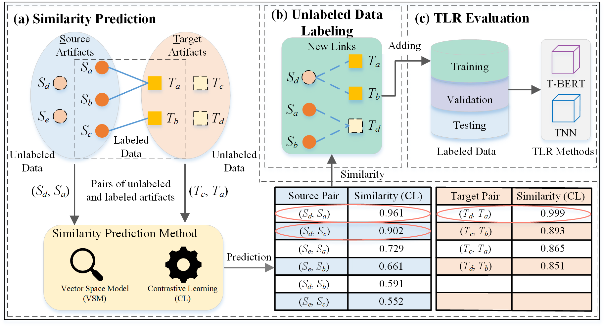

# TraceFUN
Enhancing Traceability Link Recovery with Unlabeled Data



### Installation
Run the following command to install software dependencies (Python >= 3.8) on a Windows 10 platform with an Nvidia RTX 2080Ti GPU.
- Tensorflow == 2.6.0
- CUDA == 11.2
- cudNN == 8.1
```commandline
pip install -r requirements.txt
```

### Step 0: Standardize Data
Before using TraceFUN, standardize software artifact data to a **csv** file by the following format.

**Artifacts** 
```
| id    | doc   |
| ----- | ----- |
| 123   | xxxxx |
```
**Links** 
```
| s_id  | t_id  |
| ----- | ----- |
| 123   | 456   |
```

TraceFUN uses two sources of data, the [CoEST](http://www.coest.org/) datasets used for training contrastive learning model and the [TLR](https://zenodo.org/record/4511291#.YB3tjyj0mbg). These two datasets are provided in the folder *data*. 
#### 0.1 CoEST Data ####
Run the python file **Run_CoEST.py** in the folder *Data_Process/CoEST_data_process/* to automatically convert the CoEST data to standard format.

#### 0.2 TLR Data ####
Run the python file **standardize.py** in the folder *Data_Process/TLR_data_process/* to automatically convert the data to standard format and divide it into 5 folds of samples for cross-validation.

The standardized data is stored in the folder *standard*, where should have the following three files:
```python
source.csv  # source artifacts
target.csv  # target artifacts
link.csv  # traceability links
```

### Step 1: Similarity Prediction
TraceFUN introduces two similarity prediction methods, i.e., vector space model (VSM) and contrastive learning (CL). These two similarity prediction methods are stored in the folder *Similarity_Prediction_Method*.
#### 1.1 VSM
Run the script file **Run_VSM.sh** in the folder *Similarity_Prediction_Method/* by Git Bash to get the similarity lists between unlabeled and labeled artifacts by VSM.

#### 1.2 CL
##### 1.2.1 Training Data Generation ####
Run the python file **Training_data_generation_for_CL.py** in the folder *Similarity_Prediction_Method/* to get the **train.csv** (Training data for CL). 

##### 1.2.2 CL Model Training #####
Run the python file **Train_the_model_for_CL.py** in the folder *Similarity_Prediction_Method/* to train the CL model. 

##### 1.2.3 Similarity Prediction by CL #####
Run the script file **Run_CL.sh** in the folder *Similarity_Prediction_Method/* by Git Bash to get the similarity lists between unlabeled and labeled artifacts by CL.

### Step 2: Unlabeled Data Labeling
Run the python file **unlabeled_data_labeling.py** to get the files of newly labeled links by VSM, CL, and random selection, respectively:
```python
labeling_result_by_vsm.csv
labeling_result_by_cl.csv
labeling_result_by_random.csv
```

> The calculated similarity lists can be found at [Similaritylists](https://drive.google.com/drive/folders/12Awy6Mim_rRY72Sz34Tmdt_0L9vbgaJW).

### Step 3: TLR Evaluation
Run the python file **new_links2training_set.py** in the folder *Data_Process/TLR_data_process/* to add the newly labeled links to the training set for TLR evaluation.


> The TLR methods (Trace BERT and TraceNN) evaluated in this paper can be found at [TraceBERT](https://github.com/jinfenglin/TraceBERT).

## Citation
```
@inproceedings{zhu2022enhancing,
  title={Enhancing Traceability Link Recovery with Unlabeled Data},
  author={Zhu, Jianfei and Xiao, Guanping and Zheng, Zheng and Sui, Yulei},
  booktitle={2022 IEEE 33rd International Symposium on Software Reliability Engineering (ISSRE)},
  pages={446--457},
  year={2022},
  organization={IEEE}
}
```
